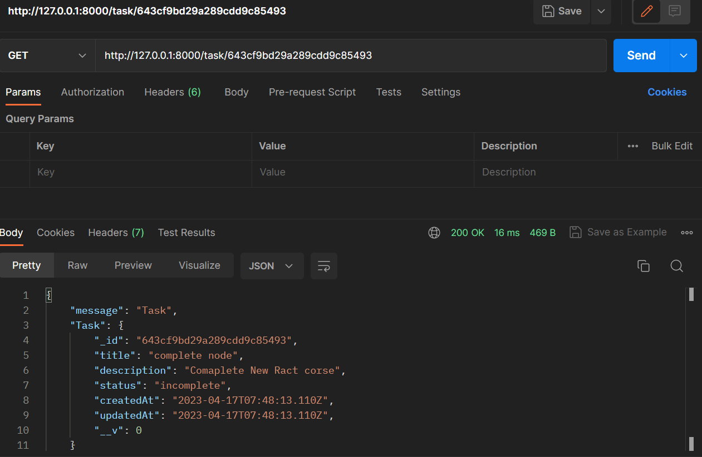
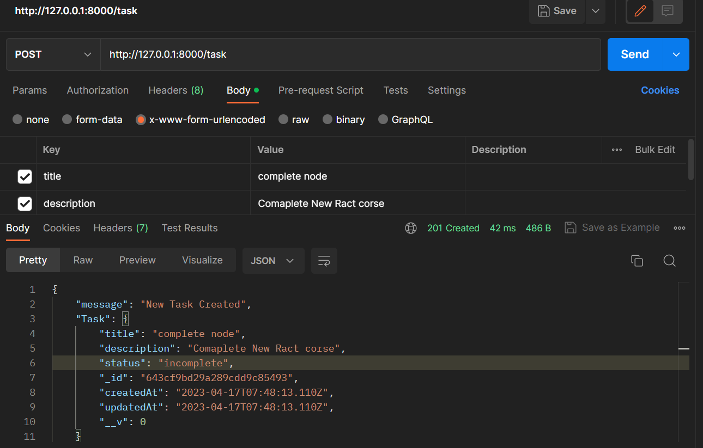
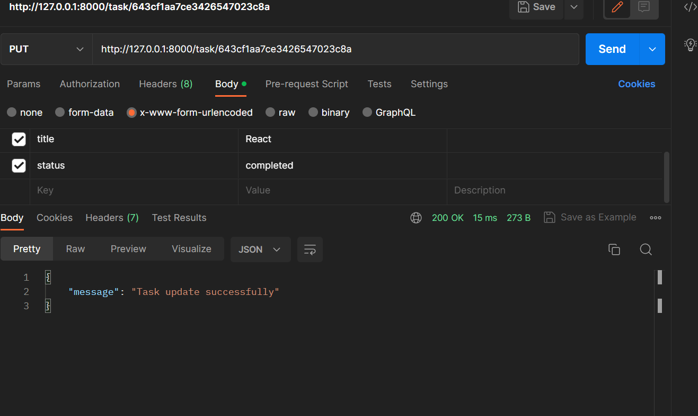
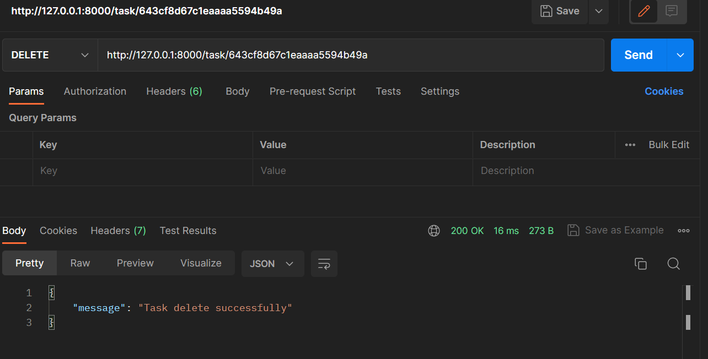

# TODO-API Guruji-astro-assignment
 
##Problem Statement 
1. Create a RESTful API that allows users to manage a list of tasks.
2. The API shouldhave the following endpoints:
    1. GET /tasks - Returns a list of all tasks.
    2. GET /tasks/:id - Returns the details of a single task with the given id.
    3. POST /tasks - Creates a new task.
    4. PUT /tasks/:id - Updates the task with the given id.
    5. DELETE /tasks/:id - Deletes the task with the given id.

##Functionality 
1. add task
2. delete task
3. update task
4. view all tasks
5. view specific task 

##Tools
1. Node Js v-16.18.0
2. Express Js
3. Mongodb 
4. Mongoose

##Setup in Local System

1. git clone "https://github.com/tush8788/TODO-API-Gurujo-astro.git"
2. open command prompt and Type 'npm install' for download all dependencies
3. then just "npm start"/ if npm start is not work just run this command 'node index.js'
4. then go localhost:8000

##Screenshorts

1. All Tasks

2. View specific task

3. Create new Tasks

4. Update task

5. Delete Tasks

